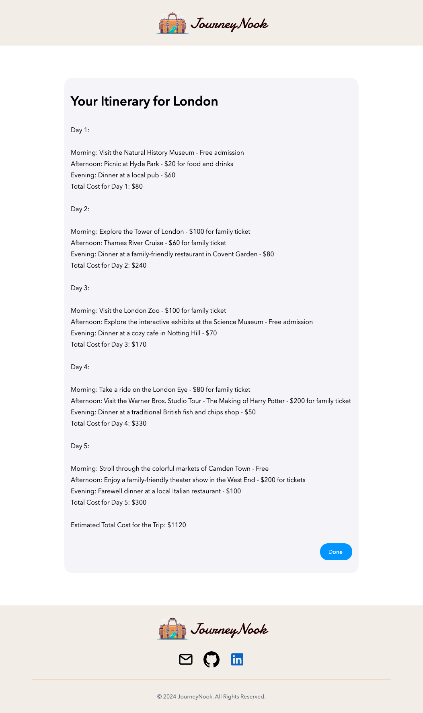
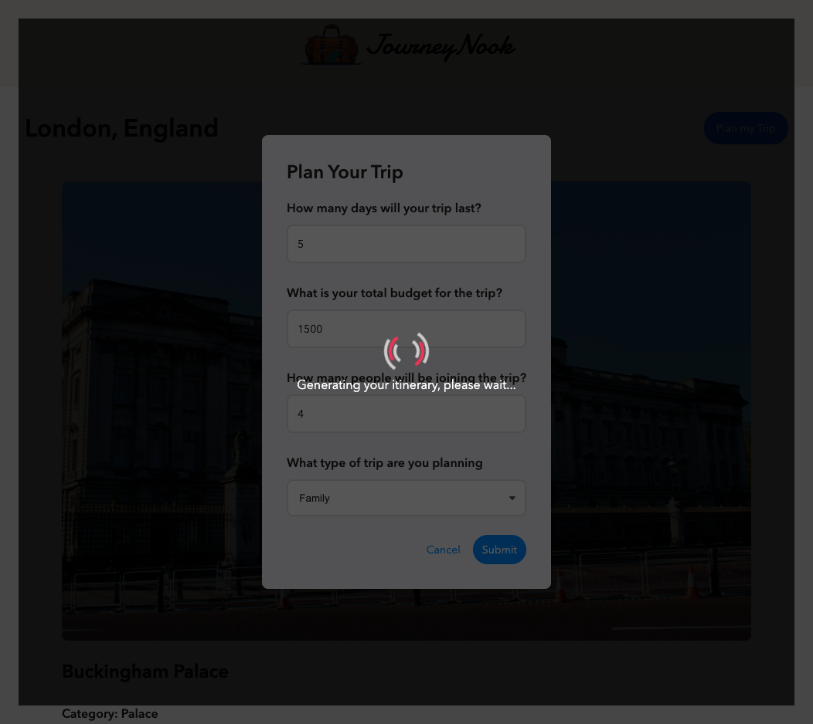

# Project Title
JourneyNook

## Overview

JourneyNook is an AI-powered travel itinerary planner that helps users generate personalized trip plans tailored to their preferences. Whether you're planning a quick getaway or a long vacation, JourneyNook simplifies the process by automatically creating detailed itineraries based on the number of days, budget, and trip type. In addition to itinerary creation, users can explore cities and discover key landmarks and attractions within each destination, gaining insights into must-see locations.

### Problem Space

Planning a trip can be overwhelming, especially when trying to organize activities, manage a budget, and keep track of the best places to visit. JourneyNook addresses this issue by offering users a convenient and intuitive tool to design itineraries with detailed information on attractions, travel tips, and cost management.

### User Profile

- Travel enthusiasts who are planning a trip and need a structured way to organize their daily activities.
-Casual explorers wanting suggestions for landmarks and travel tips in various cities.

### Features

- **Explore Destinations**: Users can browse different cities, each featuring iconic landmarks and scenic spots, and view detailed descriptions of each location to help plan their trips.

- **AI-Powered Itinerary Generation**: Users can generate personalized itineraries by providing trip details such as the number of days, budget, and trip type. The app creates a detailed schedule based on the input, helping users get started with trip planning.

- **Budget Overview**: Users can enter their trip budget and see how much they have to spend on activities. While the itinerary is being generated, the app provides a budget overview based on the suggested activities.

- **Trip Planning**: Users can plan their trips by selecting the "Plan My Trip" option, which takes them to a dynamic itinerary page that organizes their days and activities based on the input provided.

# App Previews

Below are some screenshots that give an overview of the different pages and features of the JourneyNook app.

### 1. Home Page

The landing page of the app where users can get an overview of popular travel destinations.

---

### 2. City Detail Page

Detailed information about a specific city, including top attractions, recommended times to visit, entrance fee, opening hours, and nearby places of interest of that specific attraction.

---

### 3. Itinerary Page

Shows a dynamically generated itinerary with AI based on the user’s input, including travel days, budget, and type of trip.

---

### 4. Trip Planning Modal

A modal where users can enter details about their trip, such as the number of days, budget, and type of trip. This information is used to create a custom itinerary.

---

### 5. Loading Spinner for Itinerary

A loading spinner that appears while the app (AI) generates the itinerary based on the user’s preferences. This ensures the user knows the system is working.

---

## Implementation

### Tech Stack
- React
- MySQL
- Express
- Client libraries: 
    - react
    - react-router
    - react-router-dom
    - react-svg 
    - axios
    - dotenv
    - react-dom
    - sass

- Server libraries:
    - knex
    - express
    - dotenv
    - cors
    - mysql2
    - axios

### APIs
OpenAI API: The OpenAI API powers the AI-driven itinerary generation feature in JourneyNook.

